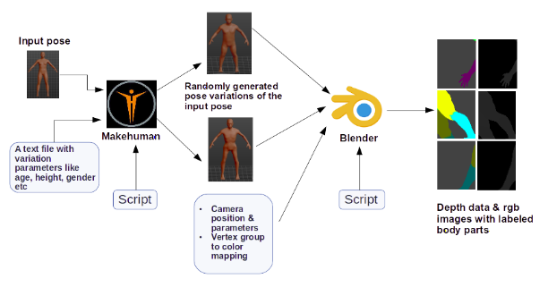

# makehuman_blender

This project helps you create random human poses with the help of Makehuman and then generates their rgbd data using Blender.

  
For more details read section 3.2 of this [report](https://dugarsumit.github.io/files/idp-report.pdf)

## Dependencies
-  Makehuman
-  Blender

## File Description
1) **generatePoses.py** - Run this script inside makehuman's python console. It will generate different variations of human poses based on parameters like age, gender, height, weight etc. These variations are generated from a provided seed pose.

2) **generateViews.py** - Run this script inside blender's python console. It will render depth images of poses from different camera views. It will also generate rgb images in which body parts are color coded. Open Blender from commandline in order to see print statements and errors from this script.

3) **basicPose.mhm** - Put this file in input_poses directory under the base directory poseSamples. It is the basic pose
from which variations will be generated. Make sure this human model has **default skeleton**. Any other skeleton type will break the generatePose script.

4) **camera_positions.txt** - Put this file in input_files folder under the base directory poseSamples. It contains parameters for controlling various camera orientations.

5) **pose_parameters.txt** - Put this file in input_files folder under the base directory poseSamples. It contains various human model parameters such as age, gender, height, weight etc based on which pose variations are generated.

6) **camera_properties.txt** - This file lets you set different camera parameters like focal lenght, sensor size etc. Put this file in the input_files folder.

7) **vertex_groups.txt** - This file defines a mapping between vertiex groups and their correspoding color depiction. Put this file in the input_files folder. Following rgb values are currently being used.
```
   Torso            : 0,255,0
   Head             : 0,0,255
   Upper left arm   : 255,0,0
   Upper right arm  : 100,0,0
   Lower left arm   : 255,0,255
   Lower right arm  : 100,0,100
   Upper left leg   : 255,255,0
   Upper right leg  : 100,100,0
   Lower left leg   : 0,255,255
   Lower right leg  : 0,100,100
```
## Output File Format 
RGB images : human_<pose variation number>_<image type>_<camera view number>.png        : human_0_rgb_3.png  
Depth data : human_<pose variation number>_<image type>_<camera view number>_0001.exr   : human_0_depth_3_0001.exr

## How to use?
Follow the below steps and make sure to make appropriate path changes in the scripts.
1. Manually create a human pose in the Makehuman software. Make sure this human model has the **default skeleton** structure as any other skeleton type will break the generatePose script. Export the model as .mhm file and place it in the `input_poses` folder. You may also need to install an extra .mhm plugin in Makehuman for this.
2. Add pose variation parmeters in the `pose_parameters.txt` file. All the parameters mentioned in this file will be used for varitions. This is the complete list of parameters currently supported by the script - `age, gender, height, muscle, weight, asianVal, africanVal, caucasianVal, breastsize`.
3. Change the base path accordingly in `generatePoses.py` and run this script in makehuman's python console. This will generate multiple poses of your provided base pose and save them in the `posed_mh` folder. It will also export the generated poses in the .dae format in `dae_files` folder. This format is required for importing these poses into blender for further processing.
4. Now comes the difficult part of manually choosing the camera parameters and it's initial position. Choose these values according to the needs of your scene perspective. Set these values in the `camera_properties.txt` and `camera_positions.txt` files.
5. Change the base path accordingly in `generateViews.py` and run this script in blender's python console. For every pose present in `posed_mh` folder this script will render rgb and depth data of 360 degree views around the model from the provided camera positions. The rendered output will be stored in `render_data` folder. 
